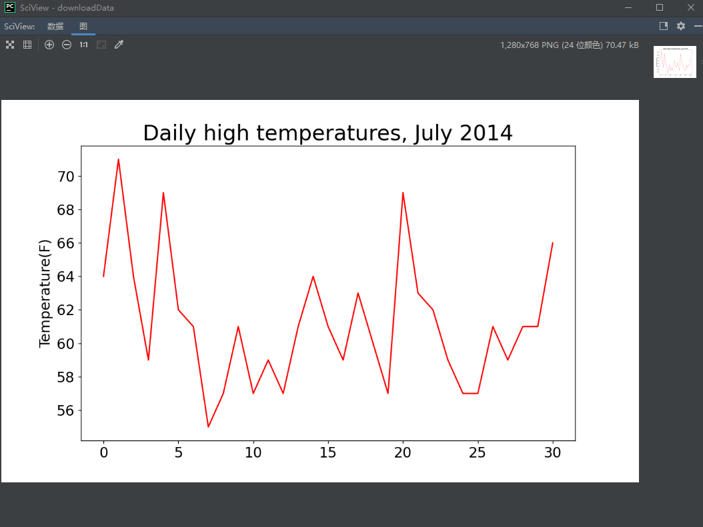
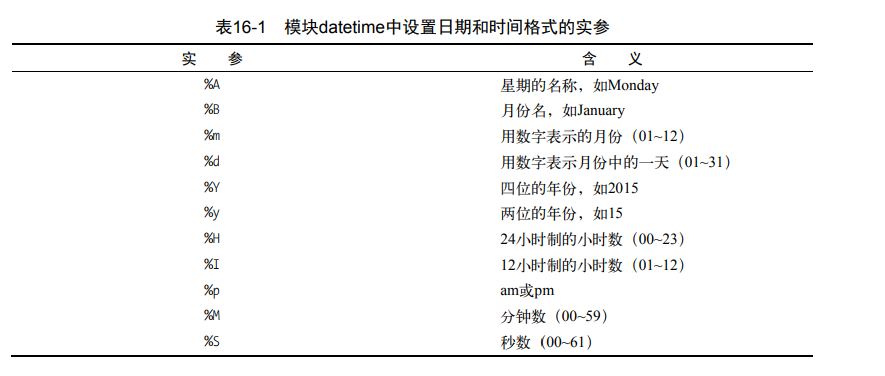
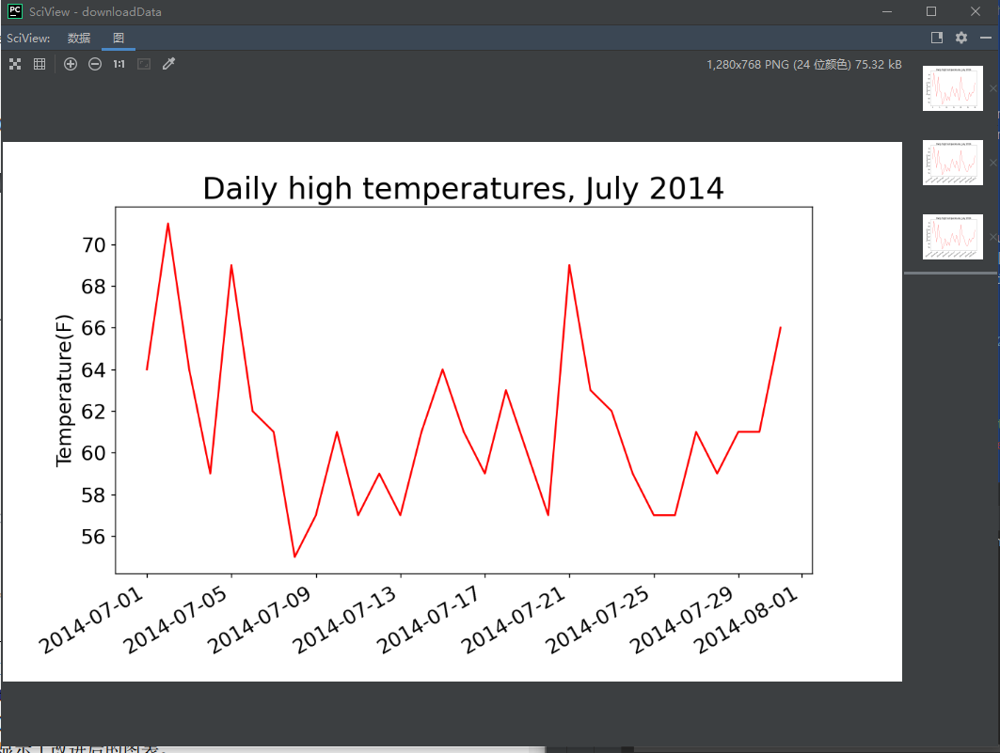
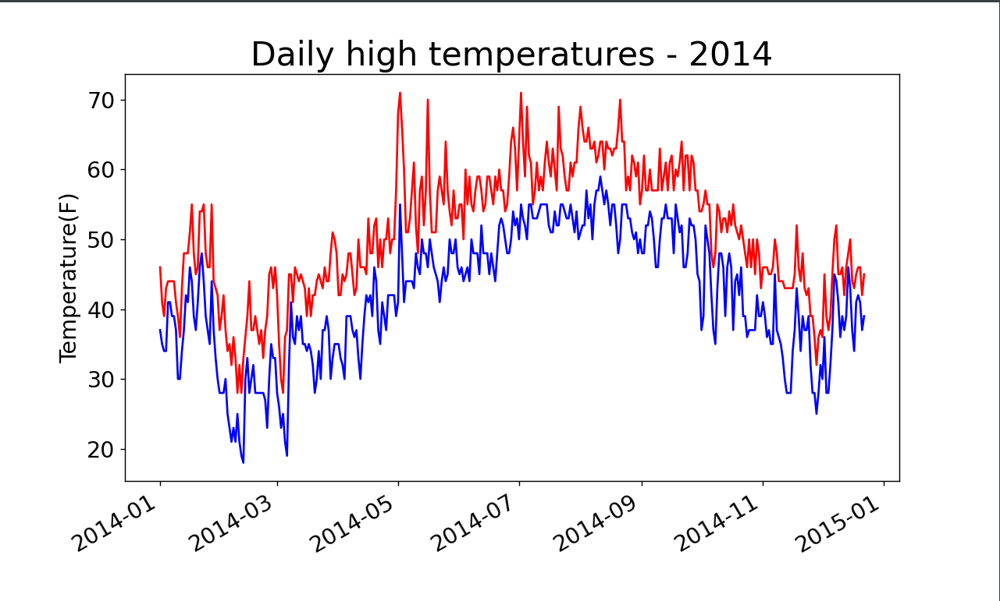
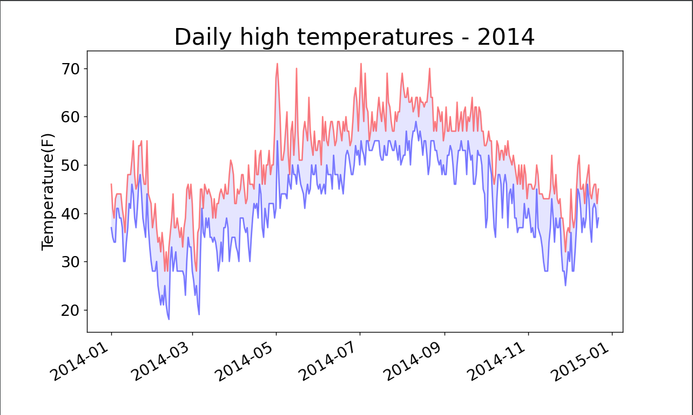
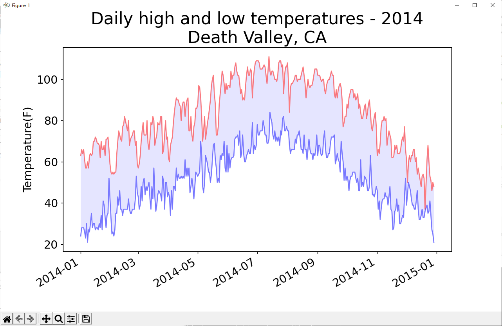

# 数据可视化——下载数据

# CSV文件格式

要在文本文件中存储数据，最简单的方式是将数据作为一系列以逗号分隔的值（CSV）写入文件。这样的文件称为CSV文件。例如，下面是一行CSV格式的天气数据：

```python
2014-1-5,61,44,26,18,7,-1,56,30,9,30.34,30.27,30.15,,,,10,4,,0.00,0,,195
```


这里采用了一份文件：


[rxxn4qsjhw.csv](file/rxxn4qsjhw.csv)

这是阿拉斯加锡特卡2014年1月5日的天气数据，其中包含当天的最高气温和最低气温，还有众多其他数据。CSV文件对人来说阅读起来比较麻烦，但程序可轻松地提取并处理其中的值，这有助于加快数据分析过程。

# 分析CSV文件头

csv模块包含在Python标准库中，可用于分析CSV文件中的数据行，让我们能够快速提取感兴趣的值。下面先来查看这个文件的第一行，其中包含一系列有关数据的描述：

```python
import csv

filename = 'sitka_weather_07-2014.csv'

with open(filename) as f:
    reader = csv.reader(f)
    header_row = next(reader) 
    print(header_row)
```


导入模块CSV后，我们将要使用的文件名称存储在filename中。接下来，我们打开这个文件，并且将结果文件对象存储在f中。

接着我们调用csv.reader()，并且将前面存储的文件对象作为实参传递给它，从而创建一个与该文件相关联的阅读器（reader）对象。我们将这个阅读器对象存储在reader中。

模块csv包含了函数next()，调用它并将阅读器对象传递给它时，它将返回文件中的下一行。

在前面的代码中，我们只调用了next()一次，因此得到的是文件的第一行，其中包含文件头。我们将返回的数据存储在header_row中。正如你看到的，header_row包含与天气相关的文件头，指出了每行都包含哪些数据：

```python
['AKDT', 'Max TemperatureF', 'Mean TemperatureF', 'Min TemperatureF', 'Max Dew PointF', 'MeanDew PointF', 'Min DewpointF', 'Max Humidity', ' Mean Humidity', ' Min Humidity', ' Max Sea Level PressureIn', ' Mean Sea Level PressureIn', ' Min Sea Level PressureIn', ' Max VisibilityMiles', ' Mean VisibilityMiles', ' Min VisibilityMiles', ' Max Wind SpeedMPH', ' Mean Wind SpeedMPH', ' Max Gust SpeedMPH', 'PrecipitationIn', ' CloudCover', ' Events', ' WindDirDegrees']
```


reader处理文件中以逗号分隔的第一行数据，并将每项数据都作为一个元素存储在列表中。文件头AKDT表示阿拉斯加时间（Alaska Daylight Time），其位置表明每行的第一个值都是日期或时间。文件头Max TemperatureF指出每行的第二个值都是当天的最高华氏温度。可通过阅读其他的文件头来确定文件包含的信息类型。

为了让文件头数据更加容易被理解，将列表中的每个文件头以及其位置都打印出来：

```纯文本
import csv

filename = 'sitka_weather_07-2014.csv'

with open(filename) as f:
    reader = csv.reader(f)
    header_row = next(reader)
    for index, column_header in enumerate(header_row):
        print(index, column_header)
```


在这里我们使用了enumerate()函数，enumerate() 函数用于将一个可遍历的数据对象(如列表、元组或字符串)组合为一个索引序列，同时列出数据和数据下标。

输出结果如下所示：

```python
0 AKDT
1 Max TemperatureF
2 Mean TemperatureF
3 Min TemperatureF
4 Max Dew PointF
5 MeanDew PointF
6 Min DewpointF
7 Max Humidity
8  Mean Humidity
9  Min Humidity
10  Max Sea Level PressureIn
11  Mean Sea Level PressureIn
12  Min Sea Level PressureIn
13  Max VisibilityMiles
14  Mean VisibilityMiles
15  Min VisibilityMiles
16  Max Wind SpeedMPH
17  Mean Wind SpeedMPH
18  Max Gust SpeedMPH
19 PrecipitationIn
20  CloudCover
21  Events
22  WindDirDegrees
```


从中可知，日期和最高气温分别存储在第0列和第1列。为研究这些数据，我们将处理sitka_weather_07-2014.csv中的每行数据，并提取其中索引为0和1的值。

知道需要哪些列中的数据后，我们来读取一些数据。首先读取每天的最高气温：

```python
import csv

filename = 'sitka_weather_07-2014.csv'

with open(filename) as f:
    reader = csv.reader(f)
    header_row = next(reader)

    highs = []
    for row in reader:
        highs.append(row[1])

    print(highs)
```


运行的结果为：

```python
['64', '71', '64', '59', '69', '62', '61', '55', '57', '61', '57', '59', '57', '61', '64', '61', '59', '63', '60', '57', '69', '63', '62', '59', '57', '57', '61', '59', '61', '61', '66']
```


我们创建了一个名为highs的空列表，再遍历文件中余下的各行。阅读器对象从其停留的地方继续往下读取CSV文件，每次都自动返回当前所处位置的下一行。由于我们已经读取了文件头行，这个循环将从第二行开始——从这行开始包含的是实际数据。每次执行该循环时，我们都将索引1处（第2列）的数据附加到highs末。

然后我们将这些数据转换为int类型的数字，再将其附加到列表末尾。这样，最终的列表将包含以数字表示的每日最高气温：

```python
[64, 71, 64, 59, 69, 62, 61, 55, 57, 61, 57, 59, 57, 61, 64, 61, 59, 63, 60, 57, 69, 63, 62, 59, 57, 57, 61, 59, 61, 61, 66]
```


接下来我们就需要对这些数据进行可视化。

为可视化这些气温数据，我们首先使用matplotlib创建一个显示每日最高气温的简单图形，如下所示：

```python
import csv
from matplotlib import pyplot as plt

filename = 'sitka_weather_07-2014.csv'

#从文件中获取最高气温
with open(filename) as f:
    reader = csv.reader(f)
    header_row = next(reader)
    highs = []
    for row in reader:
        high = int(row[1])
        highs.append(high)

#根据数据绘制图形
fig = plt.figure(dpi=128, figsize=(10,6))
plt.plot(highs, c="red")

#设置图形的格式
plt.title("Daily high temperatures, July 2014", fontsize = 24)
plt.xlabel("", fontsize = 16)
plt.ylabel("Temperature(F)", fontsize = 16)
plt.tick_params(axis="both", which = "major", labelsize = 16)

plt.show()
```


我们首先将最高气温列表传给了plot()，并且我们通过c="red"传递以便将数据点绘制为红色。

接下来，我们设置了一些其他的格式，如字体大小和标签。

运行的结果为：




不过我们在上述的途中缺乏了x轴所表示的日期信息。

我们接下来要在图表中添加日期，使其更加有用。在天气数据文件中，第一个日期在第二行：

```python
2014-7-1,64,56,50,53,51,48,96,83,58,30.19,--snip--
```


读取该数据时，获得的是一个字符串，因为我们需要想办法将字符串'2014-7-1'转换为一个表示相应日期的对象。为创建一个表示2014年7月1日的对象，可使用模块datetime中的方法strptime()。我们在终端会话中看看strptime()的工作原理：

```python
Python 3.7.9 (tags/v3.7.9:13c94747c7, Aug 17 2020, 18:58:18) [MSC v.1900 64 bit (AMD64)] on win32
Type "help", "copyright", "credits" or "license" for more information.
>>> from datetime import datetime
>>> first_date = datetime.strptime("2014-7-1","%Y-%m-%d")
>>> print(first_date)
2014-07-01 00:00:00
```


我们首先导入了模块datetime中的tatetime类，然后调用方法strptime()，并且将包含所需日期的字符串作为第一个实参。

第二个实参则告诉了Python如何设置日期的格式，"%Y-"让Python将字符串中第一个连字符串前面的部分视为四位的年份；%m-则是让Python将第二个连字符前面的部分视为表示月份的数字；而“%d”让Python1将字符串的最后一部分视为月份中的一天。

方法strptime()可接受各种实参，并根据它们来决定如何解读日期。表16-1列出了其中一些这样的实参。




我们接着在图表中添加日期：

```python
import csv
from datetime import datetime
from matplotlib import pyplot as plt

filename = 'sitka_weather_07-2014.csv'

#从文件中获取最高气温
with open(filename) as f:
    reader = csv.reader(f)
    header_row = next(reader)

    dates, highs = [], []
    for row in reader:
        current_date = datetime.strptime(row[0], "%Y-%m-%d")
        dates.append(current_date)
        high = int(row[1])
        highs.append(high)

    #根据数据绘制图形
fig = plt.figure(dpi=128, figsize=(10,6))
plt.plot(dates, highs, c="red")

#设置图形的格式
plt.title("Daily high temperatures, July 2014", fontsize = 24)
plt.xlabel("", fontsize = 16)
fig.autofmt_xdate()
plt.ylabel("Temperature(F)", fontsize = 16)
plt.tick_params(axis="both", which = "major", labelsize = 16)

plt.show()
```


运行的结果为：




我们创建了两个空列表，用于存储从文件中提取的日期和最高气温。然后，我们将包含日期信息的数据（row[0]）转换为datetime对象，并将其附加到列表dates末尾。我们将日期和最高气温值传递给plot()。我们调用了fig.autofmt_xdate()来绘制斜的日期标签，以免它们彼此重叠。

设置好图表之后，我们来添加更多的数据，好生成一副更加复杂的锡特卡天气图。

这时候我们需要使用到另一个数据文件：


[ibzwcepqx5.csv](file/ibzwcepqx5.csv)

基于这个数据文件，我们来以创建覆盖整年的天气图：

```python
import csv
from datetime import datetime
from matplotlib import pyplot as plt

filename = 'sitka_weather_2014.csv'

#从文件中获取最高气温
with open(filename) as f:
    reader = csv.reader(f)
    header_row = next(reader)

    dates, highs, lows = [], [], []
    for row in reader:
        current_date = datetime.strptime(row[0], "%Y-%m-%d")
        dates.append(current_date)

        high = int(row[1])
        highs.append(high)

        low = int(row[3])
        lows.append(low)

    #根据数据绘制图形
fig = plt.figure(dpi=128, figsize=(10,6))
plt.plot(dates, highs, c="red")
plt.plot(dates, lows, c="blue")

#设置图形的格式
plt.title("Daily high temperatures - 2014", fontsize = 24)
plt.xlabel("", fontsize = 16)
fig.autofmt_xdate()
plt.ylabel("Temperature(F)", fontsize = 16)
plt.tick_params(axis="both", which = "major", labelsize = 16)

plt.show()
```


运行的结果为：




添加两个数据系列后，我们就可以了解每天的气温范围了。下面来给这个图表做最后的修饰，通过着色来呈现每天的气温范围。为此，我们将使用方法fill_between()，它接受一个x值系列和两个y值系列，并填充两个y值系列之间的空间：

```python
import csv
from datetime import datetime
from matplotlib import pyplot as plt

filename = 'sitka_weather_2014.csv'

#从文件中获取最高气温
with open(filename) as f:
    reader = csv.reader(f)
    header_row = next(reader)

    dates, highs, lows = [], [], []
    for row in reader:
        current_date = datetime.strptime(row[0], "%Y-%m-%d")
        dates.append(current_date)

        high = int(row[1])
        highs.append(high)

        low = int(row[3])
        lows.append(low)

    #根据数据绘制图形
fig = plt.figure(dpi=128, figsize=(10,6))
plt.plot(dates, highs, c="red", alpha = 0.5)
plt.plot(dates, lows, c="blue", alpha = 0.5)
plt.fill_between(dates, highs, lows, facecolor = "blue", alpha = 0.1)

#设置图形的格式
plt.title("Daily high temperatures - 2014", fontsize = 24)
plt.xlabel("", fontsize = 16)
fig.autofmt_xdate()
plt.ylabel("Temperature(F)", fontsize = 16)
plt.tick_params(axis="both", which = "major", labelsize = 16)

plt.show()
```


运行的结果为：




我们指定了实参alpha来指定颜色的透明度，alpha的值如果等于0则意味着完全的透明，如果是1则是完全的不透明，我们这里选择了一个中间值。

接着我们向fill_between()传递了一个x值系列：列表dates，还传递了两个y值系列：highs和lows。实参facecolor指定了填充区域的颜色，我们还将alpha设置成了较小的值0.1，让填充区域将两个数据系列连接起来的同时不分散观察者的注意力。

# 错误检查

我们应该能够使用有关任何地方的天气数据来运行highs_lows.py中的代码，但有些气象站会偶尔出现故障，未能收集部分或全部其应该收集的数据。缺失数据可能会引发异常，如果不妥善地处理，还可能导致程序崩溃。

我们可以使用加利福尼亚的死亡谷的气温数据：


[-ct5-z2jch.csv](file/-ct5-z2jch.csv)

然后我们创建一个名为death_valley.py的文件，并且将full_year.py文件中的代码复制进来然后进行修改：

```python
filename = 'death_valley_2014.csv'
```


进行运行发现：

```python
Traceback (most recent call last):
  File "death_valley.py", line 19, in <module>
    high = int(row[1])
ValueError: invalid literal for int() with base 10: ''
```


这个traceback指出，Python无法处理其中一天的最高气温，因为它无法将空字符串''转换为整数。

如果我们看一下death_valley_2014.csv中的数据，我们可以发现：

```python
2014-2-16,,,,,,,,,,,,,,,,,,,0.00,,,-1
```


也就是说该数据文件中没有记录2012年2月116日的数据，用来表示最高温度的字符串为空。

这个时候我们就可以对分析数据集时可能出现的异常进行处理：

```python
import csv
from datetime import datetime
from matplotlib import pyplot as plt

filename = 'death_valley_2014.csv'

#从文件中获取最高气温
with open(filename) as f:
    reader = csv.reader(f)
    header_row = next(reader)

    dates, highs, lows = [], [], []
    for row in reader:
        try:
            current_date = datetime.strptime(row[0], "%Y-%m-%d")
            high = int(row[1])
            low = int(row[3])
        except ValueError:
            print(current_date, 'missing data')
        else:
            dates.append(current_date)
            highs.append(high)
            lows.append(low)

    #根据数据绘制图形
fig = plt.figure(dpi=128, figsize=(10,6))
plt.plot(dates, highs, c="red", alpha = 0.5)
plt.plot(dates, lows, c="blue", alpha = 0.5)
plt.fill_between(dates, highs, lows, facecolor = "blue", alpha = 0.1)

#设置图形的格式
plt.title("Daily high and low temperatures - 2014\nDeath Valley, CA", fontsize = 24)
plt.xlabel("", fontsize = 16)
fig.autofmt_xdate()
plt.ylabel("Temperature(F)", fontsize = 16)
plt.tick_params(axis="both", which = "major", labelsize = 16)

plt.show()
```


只要确实其中一项数据，Python就会引发ValueError异常，这个时候我们就可以打印一条错误信息用来指出缺失数据的日期，然后接着循环处理下一行。

运行的结果为：

```python
2014-02-16 00:00:00 missing data
```


和：




