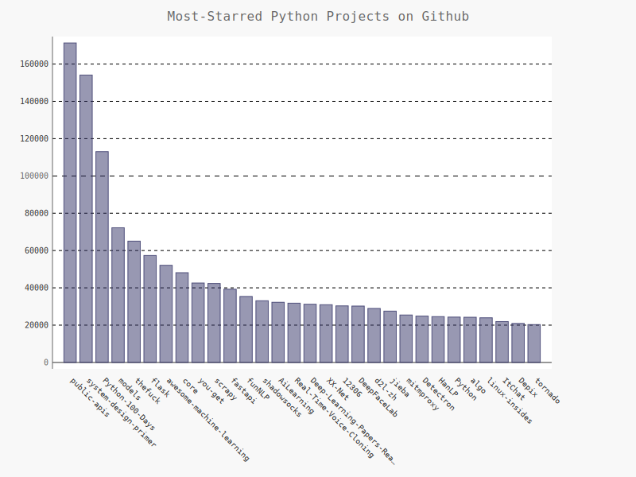

# 数据可视化——使用API

# 使用 Web API

本章的可视化将基于来自GitHub的信息，这是一个让程序员能够协作开发项目的网站。我们将使用GitHub的API来请求有关该网站中Python项目的信息，然后使用Pygal生成交互式可视化，以呈现这些项目的受欢迎程度。

GitHub的API让你能够通过API调用来请求各种信息。要知道API调用是什么样的，请在浏览器的地址栏中输入如下地址并按回车键：

```python
https://api.github.com/search/repositories?q=language:python&sort=stars
```


这个调用返回GitHub当前托管了多少个Python项目，还有有关最受欢迎的Python仓库的信息。下面来仔细研究这个调用。第一部分（[https://api.github.com/）将请求发送到GitHub网站中响应API调用的部分；接下来的一部分（search/repositories）让API搜索GitHub上的所有仓库。](https://api.github.com/）将请求发送到GitHub网站中响应API调用的部分；接下来的一部分（search/repositories）让API搜索GitHub上的所有仓库。)

repositories后面的问号指出我们要传递一个实参。q表示查询，而等号让我们能够开始指定查询（q=）。通过使用language:python，我们指出只想获取主要语言为Python的仓库的信息。最后一部分（&sort=stars）指定将项目按其获得的星级进行排序。

下面显示了响应的前几行。从响应可知，该URL并不适合人工输入。

```python
{
  "total_count": 8339355,
  "incomplete_results": true,
  "items": [
    {
      "id": 54346799,
      "node_id": "MDEwOlJlcG9zaXRvcnk1NDM0Njc5OQ==",
      "name": "public-apis",
      "full_name": "public-apis/public-apis",
      "private": false,
      "owner": {
        "login": "public-apis",
        "id": 51121562,
        "node_id": "MDEyOk9yZ2FuaXphdGlvbjUxMTIxNTYy",
        "avatar_url": "https://avatars.githubusercontent.com/u/51121562?v=4",
        "gravatar_id": "",
        "url": "https://api.github.com/users/public-apis",
        "html_url": "https://github.com/public-apis",
        "followers_url": "https://api.github.com/users/public-apis/followers",
        "following_url": "https://api.github.com/users/public-apis/following{/other_user}",
        "gists_url": "https://api.github.com/users/public-apis/gists{/gist_id}",
        "starred_url": "https://api.github.com/users/public-apis/starred{/owner}{/repo}",
        "subscriptions_url": "https://api.github.com/users/public-apis/subscriptions",
        "organizations_url": "https://api.github.com/users/public-apis/orgs",
        "repos_url": "https://api.github.com/users/public-apis/repos",
        "events_url": "https://api.github.com/users/public-apis/events{/privacy}",
        "received_events_url": "https://api.github.com/users/public-apis/received_events",
        "type": "Organization",
        "site_admin": false
      }
```


"total_count"后面的数字是在Github上面有的Python项目的总数，"incomplete_results"的值为false，据此我们知道请求是成功的（它并非不完整的）。倘若GitHub无法全面处理该API，它返回的这个值将为true。接下来的列表中显示了返回的"items"，其中包含GitHub上最受欢迎的Python项目的详细信息。

为了让向网站请求信息以及检查返回的响应，我们需要安装requests：

```python
pip isntall --user requests
```


接着我们就可以编写一个程序，来执行API的调用和处理结果：

```python
import requests

#执行API的调用和存储响应
url = "https://api.github.com/search/repositories?q=language:python&sort=stars"
r = requests.get(url)
print("Status code:", r.status_code)

#将API响应存储在一个变量中
response_dict = r.json()

#处理结果
print(response_dict.keys())
```


我们首先调用了requests模块，然后我们存储了API调用的URL，然后使用requests来执行调用。

我们调用get()并且将URL传递给它，再将响应对象存储在变量r中，响应对象包含一个名为status_code的属性，它让我们知道请求是否成功了。

接着，我们打印status_code来核实调用是否真的成功了。

这个API返回JSON格式的信息，因此我们使用方法json()将这些信息转换为一个Python字典。我们将转换得到的字典存储在response_dict中。

运行的结果为：

```python
Status code: 200
dict_keys(['total_count', 'incomplete_results', 'items'])
```


状态码为200，因此我们知道请求成功了。响应字典只包含三个键：'items'、'total_count'和'incomplete_results'。

将API调用返回的信息存储到字典中后，就可以处理这个字典中的数据了。下面来生成一些概述这些信息的输出。这是一种不错的方式，可确认收到了期望的信息，进而可以开始研究感兴趣的信息：

```python
import requests

#执行API的调用和存储响应
url = "https://api.github.com/search/repositories?q=language:python&sort=stars"
r = requests.get(url)
print("Status code:", r.status_code)

#将API响应存储在一个变量中
response_dict = r.json()
print("Total repositories:", response_dict['total_count'])

#探索与仓库有关的信息
repo_dicts = response_dict['items']
print("Repositories returned:", len(repo_dicts))

#研究第一个仓库
repo_dict = repo_dicts[0]
print("\nKeys:", len(repo_dict))

for key in sorted(repo_dict.keys()):
	print(key)
```


我们首先使用了：

```python
print("Total repositories:", response_dict['total_count'])
```


打印了与total_count相关联的值，它指出了GitHub总共包含多少个Python仓库。

与'items'相关联的值是一个列表，其中包含很多字典，而每个字典都包含有关一个Python仓库的信息。我们将这个字典列表存储在repo_dicts中。接下来，我们打印repo_dicts的长度，以获悉我们获得了多少个仓库的信息。

为更深入地了解返回的有关每个仓库的信息，我们提取了repo_dicts中的第一个字典，并将其存储在repo_dict中。接下来，我们打印这个字典包含的键数，看看其中有多少信息。我们打印这个字典的所有键，看看其中包含哪些信息。

运行的结果为：

```python
Status code: 200
Total repositories: 8404802
Repositories returned: 30

Keys: 78
allow_forking
archive_url
archived
assignees_url
blobs_url
branches_url
clone_url
collaborators_url
comments_url
commits_url
compare_url
contents_url
contributors_url
created_at
default_branch
deployments_url
description
disabled
downloads_url
events_url
fork
forks
forks_count
forks_url
full_name
git_commits_url
git_refs_url
git_tags_url
git_url
has_downloads
has_issues
has_pages
has_projects
has_wiki
homepage
hooks_url
html_url
id
is_template
issue_comment_url
issue_events_url
issues_url
keys_url
labels_url
language
languages_url
license
merges_url
milestones_url
mirror_url
name
node_id
notifications_url
open_issues
open_issues_count
owner
private
pulls_url
pushed_at
releases_url
score
size
ssh_url
stargazers_count
stargazers_url
statuses_url
subscribers_url
subscription_url
svn_url
tags_url
teams_url
topics
trees_url
updated_at
url
visibility
watchers
watchers_count
```


从上述结果可以发现，repo_dict包含有78个键。

我们可以来提取与repo_dict中与一些键相关联的值：

```python
import requests

#执行API的调用和存储响应
url = "https://api.github.com/search/repositories?q=language:python&sort=stars"
r = requests.get(url)
print("Status code:", r.status_code)

#将API响应存储在一个变量中
response_dict = r.json()
print("Total repositories:", response_dict['total_count'])

#探索与仓库有关的信息
repo_dicts = response_dict['items']
print("Repositories returned:", len(repo_dicts))

#研究第一个仓库
repo_dict = repo_dicts[0]
print("\nKeys:", len(repo_dict))

print("\nSelected information about first repository:")
print('Name:', repo_dict['name'])
print('Owner:', repo_dict['owner']['login'])
print('Stars:', repo_dict['stargazers_count'])
print('Repository:', repo_dict['html_url'])
print('Created:', repo_dict['created_at'])
print('Updated:', repo_dict['updated_at'])
print('Description:', repo_dict['description'])
```


我们首先打印了项目的名字，接着使用owner来访问表示所有者的字典，接着我们使用键key来获取所有者的登录名，然后我们打印项目获得了多少个星的评级，以及项目在GitHub仓库的URL，最后我们打印出来了对仓库的描述。

运行的结果为：

```python
Status code: 200
Total repositories: 8281074
Repositories returned: 30

Keys: 78

Selected information about first repository:
Name: public-apis
Owner: public-apis
Stars: 171308
Repository: https://github.com/public-apis/public-apis
Created: 2016-03-20T23:49:42Z
Updated: 2021-12-13T10:08:55Z
Description: A collective list of free APIs
```


由于我们需要覆盖多个仓库，所以我们将会实现一个循环：

```python
import requests

#执行API的调用和存储响应
url = "https://api.github.com/search/repositories?q=language:python&sort=stars"
r = requests.get(url)
print("Status code:", r.status_code)

#将API响应存储在一个变量中
response_dict = r.json()
print("Total repositories:", response_dict['total_count'])

#探索与仓库有关的信息
repo_dicts = response_dict['items']
print("Repositories returned:", len(repo_dicts))

print("\nSelected information about each repository:")
for repo_dict in repo_dicts:
	print('\nName:', repo_dict['name'])
	print('Owner:', repo_dict['owner']['login'])
	print('Stars:', repo_dict['stargazers_count'])
	print('Repository:', repo_dict['html_url'])
	print('Description:', repo_dict['description'])
```


运行的结果为：

```python
Status code: 200
Total repositories: 8208296
Repositories returned: 30

Selected information about each repository:

Name: public-apis
Owner: public-apis
Stars: 171308
Repository: https://github.com/public-apis/public-apis
Description: A collective list of free APIs

Name: system-design-primer
Owner: donnemartin
Stars: 154106
Repository: https://github.com/donnemartin/system-design-primer
Description: Learn how to design large-scale systems. Prep for the system design interview.  Includes Anki flashcards.

Name: Python
Owner: TheAlgorithms
Stars: 125402
Repository: https://github.com/TheAlgorithms/Python
Description: All Algorithms implemented in Python

Name: awesome-python
Owner: vinta
Stars: 109777
Repository: https://github.com/vinta/awesome-python
Description: A curated list of awesome Python frameworks, libraries, software and resources

Name: youtube-dl
Owner: ytdl-org
Stars: 103129
Repository: https://github.com/ytdl-org/youtube-dl
Description: Command-line program to download videos from YouTube.com and other video sites

Name: thefuck
Owner: nvbn
Stars: 65046
Repository: https://github.com/nvbn/thefuck
Description: Magnificent app which corrects your previous console command.

Name: transformers
Owner: huggingface
Stars: 55433
Repository: https://github.com/huggingface/transformers
Description: 🤗 Transformers: State-of-the-art Machine Learning for Pytorch, TensorFlow, and JAX.

Name: httpie
Owner: httpie
Stars: 52990
Repository: https://github.com/httpie/httpie
Description: As easy as /aitch-tee-tee-pie/ 🥧 Modern, user-friendly command-line HTTP client for the API era. JSON support, colors, sessions, downloads, plugins & more. https://twitter.com/httpie

Name: awesome-machine-learning
Owner: josephmisiti
Stars: 52093
Repository: https://github.com/josephmisiti/awesome-machine-learning
Description: A curated list of awesome Machine Learning frameworks, libraries and software.

Name: ansible
Owner: ansible
Stars: 51011
Repository: https://github.com/ansible/ansible
Description: Ansible is a radically simple IT automation platform that makes your applications and systems easier to deploy and maintain. Automate everything from code deployment to network configuration to cloud management, in a language that approaches plain English, using SSH, with no agents to install on remote systems. https://docs.ansible.com.

Name: core
Owner: home-assistant
Stars: 48131
Repository: https://github.com/home-assistant/core
Description: :house_with_garden: Open source home automation that puts local control and privacy first.

Name: you-get
Owner: soimort
Stars: 42588
Repository: https://github.com/soimort/you-get
Description: :arrow_double_down: Dumb downloader that scrapes the web

Name: face_recognition
Owner: ageitgey
Stars: 42474
Repository: https://github.com/ageitgey/face_recognition
Description: The world's simplest facial recognition api for Python and the command line

Name: scrapy
Owner: scrapy
Stars: 42324
Repository: https://github.com/scrapy/scrapy
Description: Scrapy, a fast high-level web crawling & scraping framework for Python.

Name: cpython
Owner: python
Stars: 41718
Repository: https://github.com/python/cpython
Description: The Python programming language

Name: big-list-of-naughty-strings
Owner: minimaxir
Stars: 41617
Repository: https://github.com/minimaxir/big-list-of-naughty-strings
Description: The Big List of Naughty Strings is a list of strings which have a high probability of causing issues when used as user-input data.

Name: manim
Owner: 3b1b
Stars: 39584
Repository: https://github.com/3b1b/manim
Description: Animation engine for explanatory math videos

Name: fastapi
Owner: tiangolo
Stars: 39290
Repository: https://github.com/tiangolo/fastapi
Description: FastAPI framework, high performance, easy to learn, fast to code, ready for production

Name: localstack
Owner: localstack
Stars: 37640
Repository: https://github.com/localstack/localstack
Description: 💻  A fully functional local AWS cloud stack. Develop and test your cloud & Serverless apps offline!

Name: funNLP
Owner: fighting41love
Stars: 35385
Repository: https://github.com/fighting41love/funNLP
Description: 中英文敏感词、语言检测、中外手机/电话归属地/运营商查询、名字推断性别、手机号抽取、身份证抽取、邮箱抽取、中 日文人名库、中文缩写库、拆字词典、词汇情感值、停用词、反动词表、暴恐词表、繁简体转换、英文模拟中文发音、汪峰歌词生成器、职业名称词库、同义词库、反义词库、否定词库、汽车品牌词库、汽车零件词库、连续英文切割、各种中文词向量、公司名字大全、古诗词库、IT词库、财经词库、成语词库、地名词库、历史名人词库、诗词词库、医学词库、饮食词库、法律词库、汽车词库、动物词库、中文聊天语料、中文谣言数据、百度中文问答数据集、句子相似度匹配算法集合、bert资源、文本生成&摘要相关工具、cocoNLP信息抽取工具、国内电话号码正则匹配、清华大学XLORE:中英文跨语言百科知识图谱、清华大学人工智能技术系列报告、自然语言生成、NLU太难了 系列、自动对联数据及机器人、用户名黑名单列表、罪名法务名词及分类模型、微信公众号语料、cs224n深度学习自然语言处理课程、中文手写汉字识别、中文自然语言处理 语料/数据集、变量命名神器、分词语料库+代码、任务型对话英文数据集、ASR 语音数据集 + 基于深度学习的中文语音识别系统、笑声检测器、Microsoft多语言数字/单位/如日期时间识别包、中华新华字典数据库及api(包括常用歇后 语、成语、词语和汉字)、文档图谱自动生成、SpaCy 中文模型、Common Voice语音识别数据集新版、神经网络关系抽取、基于bert的命 名实体识别、关键词(Keyphrase)抽取包pke、基于医疗领域知识图谱的问答系统、基于依存句法与语义角色标注的事件三元组抽取、依存句法分析4万句高质量标注数据、cnocr：用来做中文OCR的Python3包、中文人物关系知识图谱项目、中文nlp竞赛项目及代码汇总、中文 字符数据、speech-aligner: 从“人声语音”及其“语言文本”产生音素级别时间对齐标注的工具、AmpliGraph: 知识图谱表示学习(Python)库：知识图谱概念链接预测、Scattertext 文本可视化(python)、语言/知识表示工具：BERT & ERNIE、中文对比英文自然语言处理NLP的区别综述、Synonyms中文近义词工具包、HarvestText领域自适应文本挖掘工具（新词发现-情感分析-实体链接等）、word2word：(Python)方便易用的多语言词-词对集：62种语言/3,564个多语言对、语音识别语料生成工具：从具有音频/字幕的在线视频创建自动语音识别(ASR)语料库、构建医疗实体识别的模型（包含词典和语料标注）、单文档非监督的关键词抽取、Kashgari中使用gpt-2语言模型、开源的金融投资数据提取工具、文本自动摘要库TextTeaser: 仅支持英文、人民日报语料处理工具集、一些关于自然语言的基本模型、基于14W歌曲知识库的问答尝试--功能包括歌词接龙and已知歌词找歌曲以及歌曲歌手歌词三角关系的问答、基于Siamese bilstm模型的相似句子判定模型并提供训练数据集和测试数据集、用Transformer编解码模型实现的根据Hacker News文章标题自动生成评论、用BERT进行序列标记和文本分类的模板代码、LitBank：NLP数据集——支持自然语言处理和计算人文学科任务的100部带标记英文小说语料、百度开源的基 准信息抽取系统、虚假新闻数据集、Facebook: LAMA语言模型分析，提供Transformer-XL/BERT/ELMo/GPT预训练语言模型的统一访问接口、CommonsenseQA：面向常识的英文QA挑战、中文知识图谱资料、数据及工具、各大公司内部里大牛分享的技术文档 PDF 或者 PPT、自然语言生成SQL语句（英文）、中文NLP数据增强（EDA）工具、英文NLP数据增强工具 、基于医药知识图谱的智能问答系统、京东商品知识 图谱、基于mongodb存储的军事领域知识图谱问答项目、基于远监督的中文关系抽取、语音情感分析、中文ULMFiT-情感分析-文本分类-语料及模型、一个拍照做题程序、世界各国大规模人名库、一个利用有趣中文语料库 qingyun 训练出来的中文聊天机器人、中文聊天机器 人seqGAN、省市区镇行政区划数据带拼音标注、教育行业新闻语料库包含自动文摘功能、开放了对话机器人-知识图谱-语义理解-自然语 言处理工具及数据、中文知识图谱：基于百度百科中文页面-抽取三元组信息-构建中文知识图谱、masr: 中文语音识别-提供预训练模型-高识别率、Python音频数据增广库、中文全词覆盖BERT及两份阅读理解数据、ConvLab：开源多域端到端对话系统平台、中文自然语言处 理数据集、基于最新版本rasa搭建的对话系统、基于TensorFlow和BERT的管道式实体及关系抽取、一个小型的证券知识图谱/知识库、复 盘所有NLP比赛的TOP方案、OpenCLaP：多领域开源中文预训练语言模型仓库、UER：基于不同语料+编码器+目标任务的中文预训练模型仓 库、中文自然语言处理向量合集、基于金融-司法领域(兼有闲聊性质)的聊天机器人、g2pC：基于上下文的汉语读音自动标记模块、Zincbase 知识图谱构建工具包、诗歌质量评价/细粒度情感诗歌语料库、快速转化「中文数字」和「阿拉伯数字」、百度知道问答语料库、基 于知识图谱的问答系统、jieba_fast 加速版的jieba、正则表达式教程、中文阅读理解数据集、基于BERT等最新语言模型的抽取式摘要提取、Python利用深度学习进行文本摘要的综合指南、知识图谱深度学习相关资料整理、维基大规模平行文本语料、StanfordNLP 0.2.0： 纯Python版自然语言处理包、NeuralNLP-NeuralClassifier：腾讯开源深度学习文本分类工具、端到端的封闭域对话系统、中文命名实体识别：NeuroNER vs. BertNER、新闻事件线索抽取、2019年百度的三元组抽取比赛：“科学空间队”源码、基于依存句法的开放域文本知识三元组抽取和知识库构建、中文的GPT2训练代码、ML-NLP - 机器学习(Machine Learning)NLP面试中常考到的知识点和代码实现、nlp4han:中文自然语言处理工具集(断句/分词/词性标注/组块/句法分析/语义分析/NER/N元语法/HMM/代词消解/情感分析/拼写检查、XLM：Facebook的跨语言预训练语言模型、用基于BERT的微调和特征提取方法来进行知识图谱百度百科人物词条属性抽取、中文自然语言处理相关的开放任务-数据集-当前最佳结果、CoupletAI - 基于CNN+Bi-LSTM+Attention 的自动对对联系统、抽象知识图谱、MiningZhiDaoQACorpus - 580万百度知道问答数据挖掘项目、brat rapid annotation tool: 序列标注工具、大规模中文知识图谱数据：1.4亿实体、数据增 强在机器翻译及其他nlp任务中的应用及效果、allennlp阅读理解:支持多种数据和模型、PDF表格数据提取工具 、 Graphbrain：AI开源 软件库和科研工具，目的是促进自动意义提取和文本理解以及知识的探索和推断、简历自动筛选系统、基于命名实体识别的简历自动摘要、中文语言理解测评基准，包括代表性的数据集&基准模型&语料库&排行榜、树洞 OCR 文字识别 、从包含表格的扫描图片中识别表格和 文字、语声迁移、Python口语自然语言处理工具集(英文)、 similarity：相似度计算工具包，java编写、海量中文预训练ALBERT模型 、Transformers 2.0 、基于大规模音频数据集Audioset的音频增强 、Poplar：网页版自然语言标注工具、图片文字去除，可用于漫画翻译 、186种语言的数字叫法库、Amazon发布基于知识的人-人开放领域对话数据集 、中文文本纠错模块代码、繁简体转换 、 Python实现的多种文本可读性评价指标、类似于人名/地名/组织机构名的命名体识别数据集 、东南大学《知识图谱》研究生课程(资料)、. 英文拼写 检查库 、 wwsearch是企业微信后台自研的全文检索引擎、CHAMELEON：深度学习新闻推荐系统元架构 、 8篇论文梳理BERT相关模型进展与反思、DocSearch：免费文档搜索引擎、 LIDA：轻量交互式对话标注工具 、aili - the fastest in-memory index in the East 东半球最快并发索引 、知识图谱车音工作项目、自然语言生成资源大全 、中日韩分词库mecab的Python接口库、中文文本摘要/关键词提取、汉字字符特征提取器 (featurizer)，提取汉字的特征（发音特征、字形特征）用做深度学习的特征、中文生成任务基准测评 、中文缩写数据集、中文任务基准测评 - 代表性的数据集-基准(预训练)模型-语料库-baseline-工具包-排行榜、PySS3：面向可解释AI的SS3文本分类器机器可视化工具 、中文NLP数据集列表、COPE - 格律诗编辑程序、doccano：基于网页的开源协同多语言文本标注工具 、PreNLP： 自然语言预处理库、简单的简历解析器，用来从简历中提取关键信息、用于中文闲聊的GPT2模型：GPT2-chitchat、基于检索聊天机器人 多轮响应选择相关资源列表(Leaderboards、Datasets、Papers)、(Colab)抽象文本摘要实现集锦(教程 、词语拼音数据、高效模糊搜索 工具、NLP数据增广资源集、微软对话机器人框架 、 GitHub Typo Corpus：大规模GitHub多语言拼写错误/语法错误数据集、TextCluster：短文本聚类预处理模块 Short text cluster、面向语音识别的中文文本规范化、BLINK：最先进的实体链接库、BertPunc：基于BERT 的最先进标点修复模型、Tokenizer：快速、可定制的文本词条化库、中文语言理解测评基准，包括代表性的数据集、基准(预训练)模型 、语料库、排行榜、spaCy 医学文本挖掘与信息提取 、 NLP任务示例项目代码集、 python拼写检查库、chatbot-list - 行业内关于智 能客服、聊天机器人的应用和架构、算法分享和介绍、语音质量评价指标(MOSNet, BSSEval, STOI, PESQ, SRMR)、 用138GB语料训练的 法文RoBERTa预训练语言模型 、BERT-NER-Pytorch：三种不同模式的BERT中文NER实验、无道词典 - 有道词典的命令行版本，支持英汉互查和在线查询、2019年NLP亮点回顾、 Chinese medical dialogue data 中文医疗对话数据集 、最好的汉字数字(中文数字)-阿拉伯数字转换工具、 基于百科知识库的中文词语多词义/义项获取与特定句子词语语义消歧、awesome-nlp-sentiment-analysis - 情感分析、情 绪原因识别、评价对象和评价词抽取、LineFlow：面向所有深度学习框架的NLP数据高效加载器、中文医学NLP公开资源整理 、MedQuAD：(英文)医学问答数据集、将自然语言数字串解析转换为整数和浮点数、Transfer Learning in Natural Language Processing (NLP) 、 面向语音识别的中文/英文发音辞典、Tokenizers：注重性能与多功能性的最先进分词器、CLUENER 细粒度命名实体识别 Fine Grained Named Entity Recognition、 基于BERT的中文命名实体识别、中文谣言数据库、NLP数据集/基准任务大列表、nlp相关的一些论文及代码, 包括主题模型、词向量(Word Embedding)、命名实体识别(NER)、文本分类(Text Classificatin)、文本生成(Text Generation)、文本 相似性(Text Similarity)计算等，涉及到各种与nlp相关的算法，基于keras和tensorflow 、Python文本挖掘/NLP实战示例、 Blackstone：面向非结构化法律文本的spaCy pipeline和NLP模型通过同义词替换实现文本“变脸” 、中文 预训练 ELECTREA 模型: 基于对抗学习 pretrain Chinese Model 、albert-chinese-ner - 用预训练语言模型ALBERT做中文NER 、基于GPT2的特定主题文本生成/文本增广、开源预训练语言模型合集、多语言句向量包、编码、标记和实现：一种可控高效的文本生成方法、 英文脏话大列表 、attnvis：GPT2、BERT等transformer语言模型注意力交互可视化、CoVoST：Facebook发布的多语种语音-文本翻译语料库，包括11种语言(法语、德语、荷兰语、俄语、西班牙语、意大利语、土耳其语、波斯语、瑞典语、蒙古语和中文)的语音、文字转录及英文译文、Jiagu自然语言处理工具 -  以BiLSTM等模型为基础，提供知识图谱关系抽取 中文分词 词性标注 命名实体识别 情感分析 新词发现 关键词 文本摘要 文本聚类等功能、用unet实现对文档表格的自动检测，表格重建、NLP事件提取文献资源列表 、 金融领域自然语言处理研究资源大列表、CLUEDatasetSearch - 中英文NLP数据集：搜索所有中文NLP数据集，附常用英文NLP数据集 、medical_NER - 中文医学知识图谱命名实体识别 、(哈 佛)讲因果推理的免费书、知识图谱相关学习资料/数据集/工具资源大列表、Forte：灵活强大的自然语言处理pipeline工具集 、Python 字符串相似性算法库、PyLaia：面向手写文档分析的深度学习工具包、TextFooler：针对文本分类/推理的对抗文本生成模块、Haystack ：灵活、强大的可扩展问答(QA)框架、中文关键短语抽取工具

Name: shadowsocks
Owner: shadowsocks
Stars: 33087
Repository: https://github.com/shadowsocks/shadowsocks
Description: None

Name: interview_internal_reference
Owner: 0voice
Stars: 32959
Repository: https://github.com/0voice/interview_internal_reference
Description: 2021年最新总结，阿里，腾讯，百度，美团，头条等技术面试题目，以及答案，专家出题人分析汇总。

Name: PayloadsAllTheThings
Owner: swisskyrepo
Stars: 32722
Repository: https://github.com/swisskyrepo/PayloadsAllTheThings
Description: A list of useful payloads and bypass for Web Application Security and Pentest/CTF

Name: pandas
Owner: pandas-dev
Stars: 31977
Repository: https://github.com/pandas-dev/pandas
Description: Flexible and powerful data analysis / manipulation library for Python, providing labeled data structures similar to R data.frame objects, statistical functions, and much more

Name: Real-Time-Voice-Cloning
Owner: CorentinJ
Stars: 31782
Repository: https://github.com/CorentinJ/Real-Time-Voice-Cloning
Description: Clone a voice in 5 seconds to generate arbitrary speech in real-time

Name: openpilot
Owner: commaai
Stars: 31629
Repository: https://github.com/commaai/openpilot
Description: openpilot is an open source driver assistance system. openpilot performs the functions of Automated Lane Centering and Adaptive Cruise Control for over 150 supported car makes and models.

Name: Deep-Learning-Papers-Reading-Roadmap
Owner: floodsung
Stars: 31207
Repository: https://github.com/floodsung/Deep-Learning-Papers-Reading-Roadmap
Description: Deep Learning papers reading roadmap for anyone who are eager to learn this amazing tech!

Name: DeepFaceLab
Owner: iperov
Stars: 30237
Repository: https://github.com/iperov/DeepFaceLab
Description: DeepFaceLab is the leading software for creating deepfakes.

Name: bert
Owner: google-research
Stars: 29936
Repository: https://github.com/google-research/bert
Description: TensorFlow code and pre-trained models for BERT

Name: d2l-zh
Owner: d2l-ai
Stars: 28957
Repository: https://github.com/d2l-ai/d2l-zh
Description: 《动手学深度学习》：面向中文读者、能运行、可讨论。中英文版被55个国家的300所大学用于教学。
```


# 使用Pygal可视化仓库

我们首先来安装pygal模块：

```python
pip3 install pygal
```


当我们有了一些有趣的数据之后，我们可以进行数据可视化，来呈现Github上Python项目的受欢迎程度。

我们创建一个交互式条形图：条形图的高度表示项目获得了多少个星。

```python
import requests
import pygal
from pygal.style import LightColorizedStyle as LCS, LightenStyle as LS

#执行API的调用和存储响应
url = "https://api.github.com/search/repositories?q=language:python&sort=stars"
r = requests.get(url)
print("Status code:", r.status_code)

#将API响应存储在一个变量中
response_dict = r.json()
print("Total repositories:", response_dict['total_count'])

#探索与仓库有关的信息
repo_dicts = response_dict['items']

names, stars = [], []
for repo_dict in repo_dicts:
	names.append(repo_dict["name"])
	stars.append(repo_dict["stargazers_count"])

#可视化
my_style = LS("#333366", base_style = LCS)
chart = pygal.Bar(style= my_style, x_label_rotation = 45, show_legend = False)
chart.title = "Most-Starred Python Projects on Github"
chart.x_labels = names

chart.add('', stars)
chart.render_to_file("python_repos.svg")
```


我们首先导入了pygal以及要应用于图表的Pygal样式。接下来，打印API调用响应的状态以及找到的仓库总数，以便获悉API调用是否出现了问题。我们不再打印返回的有关项目的信息，因为将通过可视化来呈现这些信息。

我们首先使用：

```python
names, stars = [], []
```


创建了两个空列表，用于存储将包含在图表中的信息。

我们需要每个项目的名称，用于给条形加上标签，我们还需要知道项目获得了多少个星，用于确定条形的高度。在循环中，我们将项目的名称和获得的星数附加到这些列表的末尾

接下来，我们使用LightenStyle类（别名LS）定义了一种样式，并将其基色设置为深蓝色。我们还传递了实参base_style，以使LightColorizedStyle类（别名LCS）。然后，我们使用Bar()创建一个简单的条形图，并向它传递了my_style。我们还传递了另外两个样式实参：让标签绕x轴旋转45度（x_label_rotation=45），并隐藏了图（show_legend=False），因为我们只在图表中绘制一个数据系列。接下来，我们给图表指定了标题，并将属性x_labels设置为列表names。

由于我们不需要给这个数据系列添加标签，因此在添加数据时，将标签设置成了空字符串。

运行的结果为：

```python
Status code: 200
Total repositories: 7895797
```


和：




接着我们改进pygal图表：

```python
import requests
import pygal
from pygal.style import LightColorizedStyle as LCS, LightenStyle as LS

#执行API的调用和存储响应
url = "https://api.github.com/search/repositories?q=language:python&sort=stars"
r = requests.get(url)
print("Status code:", r.status_code)

#将API响应存储在一个变量中
response_dict = r.json()
print("Total repositories:", response_dict['total_count'])

#探索与仓库有关的信息
repo_dicts = response_dict['items']

names, stars = [], []
for repo_dict in repo_dicts:
	names.append(repo_dict["name"])
	stars.append(repo_dict["stargazers_count"])

#可视化
my_style = LS("#333366", base_style = LCS)
my_config = pygal.Config()
my_config.x_labels_rotation = 45
my_config.show_legend = False
my_config.title_font_size = 24
my_config.label_font_size = 14
my_config.major_label_font_size = 18
my_config.truncate_label = 15
my_config.show_y_guides = False
my_config.width = 1000

chart = pygal.Bar(my_config, stule = my_style)
chart.title = "Most-Starred Python Projects on Github"
chart.x_labels = names

chart.add('', stars)
chart.render_to_file("python_repos.svg")
```


我们创建了一个Pygal类Config的实例，并将其命名为my_config。通过修改my_config的属性，可定制图表的外观。

我们设置了两个属性——x_label_rotation和show_legend，它们原来是在创建Bar实例时以关键字实参的方式传递的。

我们设置了图表标题、副标签和主标签的字体大小。在这个图表中，副标签是x轴上的项目名以及y轴上的大部分数字。主标签是y轴上为5000整数倍的刻度；这些标签应更大，以与副标签区分开来。

