# 数据可视化——生成数据

# 安装matplotlib

在windows系统中安装matplotlib，可以在打开cmd界面之后输入如下所示的代码：

```python
pip3 install matplotlib
```


如果是linux系统，则可以运行：

```python
sudo apt-get install python3-matplotlib
```


我们在安装完matplotlib之后，我们可以通过导入matplotlib来测试是否成功安装matplotlib：

```python
python3
import matplotlib
```


如果没有显示如何的报错信息，则意味着成功的安装了matplotlib。

# 使用matplotlib绘制折线图

接着我们可以使用matplotlib来绘制简单的折线图：

```python
import matplotlib.pyplot as plt
squares = [1, 4, 9, 16, 25]
plt.plot(squares)
plt.show()
```


绘制的结果如下所示：


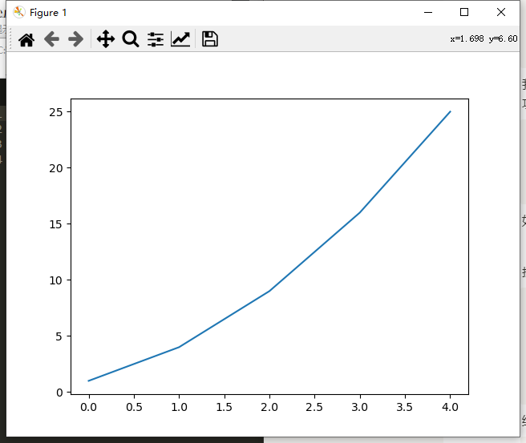

在这里，我们首先导入了matplotlib中的pyplot模块给予其别名plt，这之后当我们调用的时候只需要输入plt就可以了，不需要重复输入pyplot。

我们创建了一个列表，在其中存储了前述平方数，再将这个列表传递给函数plot()，这个函数尝试根据这些数字绘制出有意义的图形。plt.show()打开matplotlib查看器，并显示绘制的图形，

我们可以修改标签文字和线条的粗细：

```python
import matplotlib.pyplot as plt

squares = [1, 4, 9, 16, 25]
plt.plot(squares, linewidth=5)

# 设置图表标题，并给坐标轴加上标签
plt.title("Square Numbers", fontsize=24)
plt.xlabel("Value", fontsize=14)
plt.ylabel("Square of Value", fontsize=14)

# 设置刻度标记的大小
plt.tick_params(axis='both', labelsize=14)

plt.show()
```


运行的结果为：


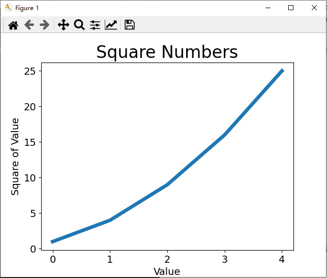

参数linewidth决定了plot()绘制的线条的粗细，而函数title()则指定了标题的大小。

函数xlabel()和ylabel()让你能够为每条轴设置标题；而函数tick_params()设置刻度的样式，其中指定的实参将影响x轴和y轴的刻度（axes='both'），并将刻度标记的字号设置为14（labelsize=14）。

另外这个折线图和我们所希望的折线图是存在着差距的，我们可以发现这个折线图是从0开始的，并且此时的y值并不是0而是1，为了解决这个问题，我们需要进行额外的设置：

```python
import matplotlib.pyplot as plt
input_values = [1, 2, 3, 4, 5]
squares = [1, 4, 9, 16, 25]
plt.plot(input_values, squares, linewidth=5) 

# 设置图表标题，并给坐标轴加上标签
plt.title("Square Numbers", fontsize=24)
plt.xlabel("Value", fontsize=14)
plt.ylabel("Square of Value", fontsize=14)

# 设置刻度标记的大小
plt.tick_params(axis='both', labelsize=14)

plt.show()
```


运行的结果为：


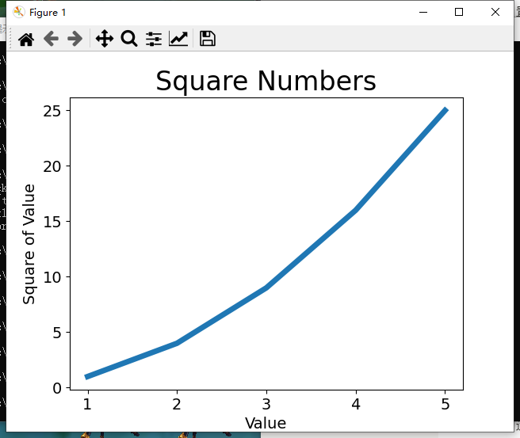

# 使用matplotlib绘制散点图

如果要绘制单个点，我们可以使用scatter()来进行绘制，并且向其中传递一对x和y的坐标，用来在指定位置绘制一个点：

```python
import matplotlib.pyplot as plt
plt.scatter(2, 4)
plt.show()
```


得到的结果如下所示：


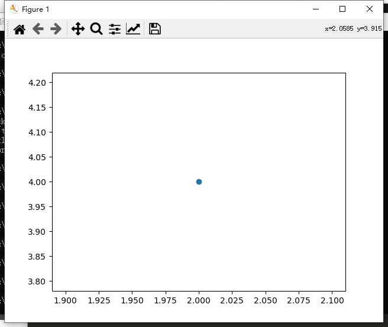

下面来设置输出的样式，使其更有趣：添加标题，给轴加上标签，并确保所有文本都大到能够看清：

```python
import matplotlib.pyplot as plt
plt.scatter(2, 4, s=200)

# 设置图表标题并给坐标轴加上标签
plt.title("Square Numbers", fontsize=24)
plt.xlabel("Value", fontsize=14)
plt.ylabel("Square of Value", fontsize=14)
# 设置刻度标记的大小
plt.tick_params(axis='both', which='major', labelsize=14)
plt.show()
```


运行结果为：


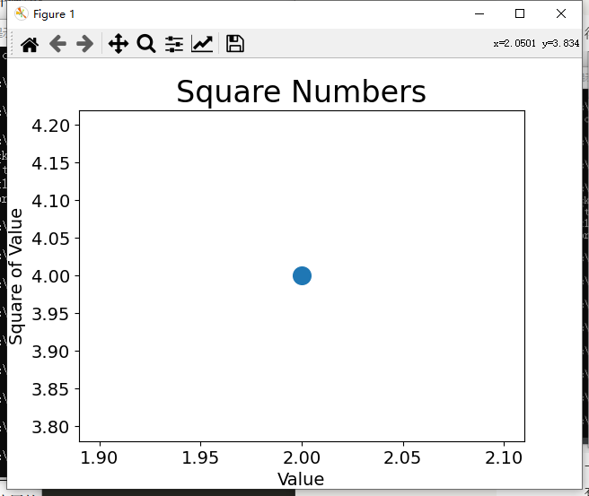

我们可以绘制一系列的点：

```python
import matplotlib.pyplot as plt
x_values = [1, 2, 3, 4, 5]
y_values = [1, 4, 9, 16, 25]
plt.scatter(x_values, y_values, s=100)

# 设置图表标题并给坐标轴加上标签
plt.title("Square Numbers", fontsize=24)
plt.xlabel("Value", fontsize=14)
plt.ylabel("Square of Value", fontsize=14)
# 设置刻度标记的大小
plt.tick_params(axis='both', which='major', labelsize=14)
plt.show()
```


运行的结果为：


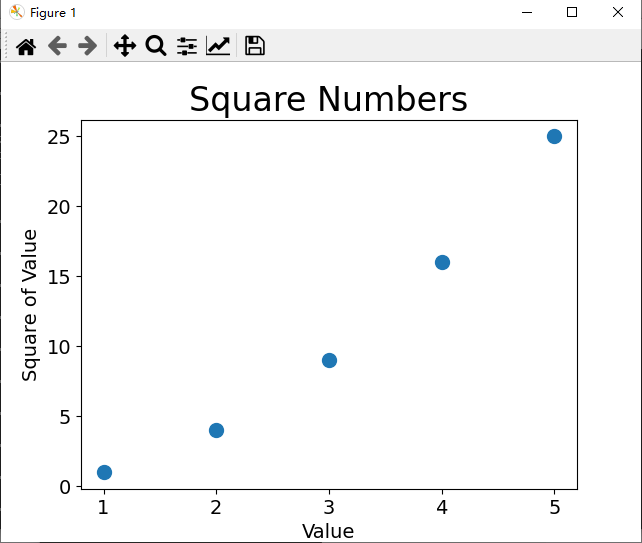

# 自动计算数据

通过手工的方式来计算列表的效率非常的低下，我们可以通过循环的方式来完成这种计算：

```python
import matplotlib.pyplot as plt
x_values = list(range(1, 1001))
y_values = [x**2 for x in x_values]
plt.scatter(x_values, y_values, s=40)

# 设置图表标题并给坐标轴加上标签
plt.title("Square Numbers", fontsize=24)
plt.xlabel("Value", fontsize=14)
plt.ylabel("Square of Value", fontsize=14)
# 设置刻度标记的大小
plt.tick_params(axis='both', which='major', labelsize=10)
plt.axis([0, 1100, 0, 1100000])
plt.show()
```


运行的结果为：


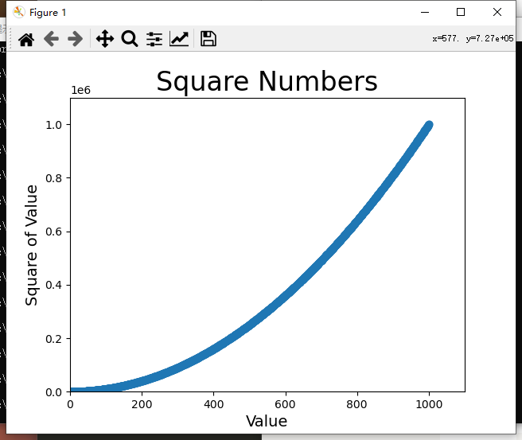

我们可以修改数据点的颜色：

```python
import matplotlib.pyplot as plt
x_values = list(range(1, 1001))
y_values = [x**2 for x in x_values]
plt.scatter(x_values, y_values, c='red', edgecolor='yellow', s=40) 

# 设置图表标题并给坐标轴加上标签
plt.title("Square Numbers", fontsize=24)
plt.xlabel("Value", fontsize=14)
plt.ylabel("Square of Value", fontsize=14)
# 设置刻度标记的大小
plt.tick_params(axis='both', which='major', labelsize=10)
plt.axis([0, 1100, 0, 1100000])
plt.show()
```


运行的结果为：


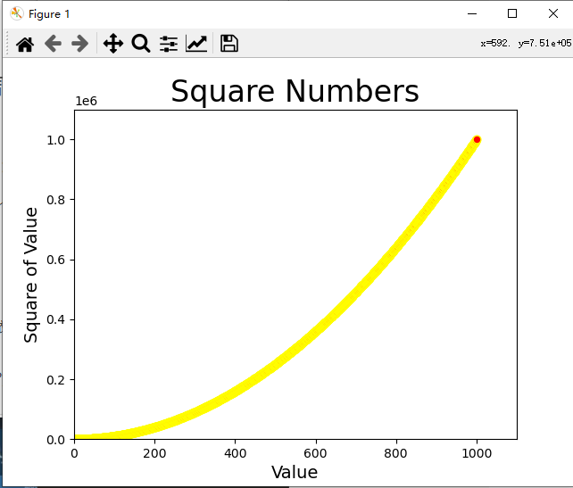

我们也可以选择消除数据点的轮廓：

```python
import matplotlib.pyplot as plt
x_values = list(range(1, 1001))
y_values = [x**2 for x in x_values]
plt.scatter(x_values, y_values,edgecolor='none', s=40) 

# 设置图表标题并给坐标轴加上标签
plt.title("Square Numbers", fontsize=24)
plt.xlabel("Value", fontsize=14)
plt.ylabel("Square of Value", fontsize=14)
# 设置刻度标记的大小
plt.tick_params(axis='both', which='major', labelsize=10)
plt.axis([0, 1100, 0, 1100000])
plt.show()
```


我们还可以使用颜色映射，也就是从启示颜色渐变到结束颜色：

```python
import matplotlib.pyplot as plt
x_values = list(range(1001))
y_values = [x**2 for x in x_values]
plt.scatter(x_values, y_values, c=y_values, cmap=plt.cm.Blues,
edgecolor='none', s=40) 

# 设置图表标题并给坐标轴加上标签
plt.title("Square Numbers", fontsize=24)
plt.xlabel("Value", fontsize=14)
plt.ylabel("Square of Value", fontsize=14)
# 设置刻度标记的大小
plt.tick_params(axis='both', which='major', labelsize=10)
plt.axis([0, 1100, 0, 1100000])
plt.show()
```


使用颜色映射可以用来展示数据的规律：


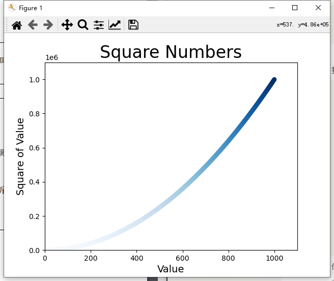

我们将参数c设置成了一个y值列表，并使用参数cmap告诉pyplot使用哪个颜色映射。这些代码将y值较小的点显示为浅蓝色，并将y值较大的点显示为深蓝色。

# 随机漫步

随机漫步是这样行走得到的路径：每次行走都完全是随机的，没有明确的方向，结果是由一系列随机决策决定的。

我们可以创建要给名为RandomWal的类，它可以随机的选择前进方向，但是这个类需要三个属性，其中一个是存储漫步次数的变量，其他两个是列表，分别存储随机漫步经过的每个x和y坐标。

RandomWalk类只包含两个方法：**init** ()和fill_walk()，其中后者计算随机漫步经过的所有点。

下面先来看看__init__()，如下所示：

```python
from random import choice

class RandomWalk():
    """一个生成随机漫步数据的类"""

    def __init__(self, num_points=5000):
        """初始化随机漫步的属性"""
        self.num_points = num_points

        # 所有随机漫步都始于(0, 0)
        self.x_values = [0]
        
        self.y_values = [0]
```


为了做出随机决策，我们将所有可能的选择都存储在一个列表中，并且在每次做出决策时都使用choice()来决定使用那种选择。

接下来，我们将随机漫步包含的默认点数设置为5000，这大到足以生成有趣的模式，同时又足够小，可以确保能够快速地模拟随机漫步。

接着我们创建了连个用于存储x值和y值的列表，并且让每次漫步都从（0,0）出发。

在这之后，我们将会采用fill_walk()来生成漫步包含的点，并且决定每次漫步的方向：

```python
from random import choice

class RandomWalk():
    """一个生成随机漫步数据的类"""

    def __init__(self, num_points=5000):
        """初始化随机漫步的属性"""
        self.num_points = num_points

        # 所有随机漫步都始于(0, 0)
        self.x_values = [0]
        
        self.y_values = [0] 

    def fill_walk(self):
    """计算随机漫步包含的所有点"""

      #不断漫步，直到列表达到指定的长度
      while len(self.x_values) < self.num_points:
        #决定前进方向以及沿着这个方向前进的距离
        x_direction = choice([1,-1])
        x_distance = choice([0, 1, 2, 3, 4])
        x_step = x_direction * x_distance

        y_direction = choice([1, -1])
        y_distance = choice([0, 1, 2, 3, 4])
        y_step = y_direction * y_distance

        #不要在原地踏步
        if x_step == 0 and y_step == 0:
          continue

        #计算下一个点的x和y的值
        next_x = self.x_values[-1] + x_step
        next_y = self.y_values[-1] + y_step

        self.x_values.append(next_x)
        self.y_value.append(next_y)
```


在原先的程序的基础上，我们建立了一个循环，这个循环会不断的运行，直到漫步包含所需数量的点。

我们使用choice([1, -1])给x_direction选择一个值，结果要么是表示向右走的1，要么是表示向左走的-1。接下来，choice([0, 1, 2, 3, 4])随机地选择一个0~4之间的整数，告诉Python 沿指定的方向走多远（x_distance）。

我们将移动方向乘以移动距离，以确定沿x和y轴移动的距离。如果x_step为正，将向右移动，为负将向左移动，而为零将垂直移动；如果y_step为正，就意味着向上移动，为负意味着向下移动，而为零意味着水平移动。如果x_step和y_step都为零，则意味着原地踏步，我们拒绝这样的情况，接着执行下一次循环。

为获取漫步中下一个点的x值，我们将x_step与x_values中的最后一个值相加，对于y值也做相同的处理。获得下一个点的x值和y值后，我们将它们分别附加到列表x_values和y_values的末尾。

然后我们创建一个名为rw_visual.py的文件，导入随机漫步类，并且绘制图片：

```python
from random import choice

class RandomWalk():
    """一个生成随机漫步数据的类"""

    def __init__(self, num_points=5000):
        """初始化随机漫步的属性"""
        self.num_points = num_points

        # 所有随机漫步都始于(0, 0)
        self.x_values = [0]  
        self.y_values = [0] 

    def fill_walk(self):
        """计算随机漫步包含的所有点"""

        #不断漫步，直到列表达到指定的长度
        while len(self.x_values) < self.num_points:
            #决定前进方向以及沿着这个方向前进的距离
            x_direction = choice([1,-1])
            x_distance = choice([0, 1, 2, 3, 4])
            x_step = x_direction * x_distance

            y_direction = choice([1, -1])
            y_distance = choice([0, 1, 2, 3, 4])
            y_step = y_direction * y_distance

            #不要在原地踏步
            if x_step == 0 and y_step == 0:
                continue

            #计算下一个点的x和y的值
            next_x = self.x_values[-1] + x_step
            next_y = self.y_values[-1] + y_step

            self.x_values.append(next_x)
            self.y_values.append(next_y)
```


生成的结果为：


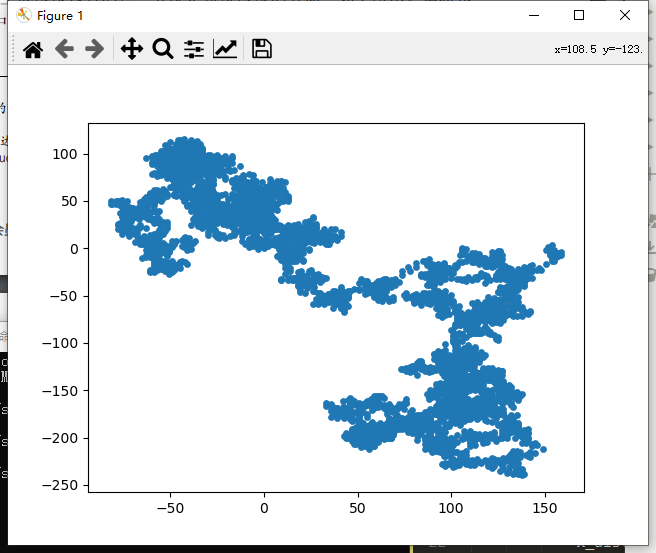

由于是随机生成的，所以每次的图片实际上都是不一样的，我们可以多尝试几次：


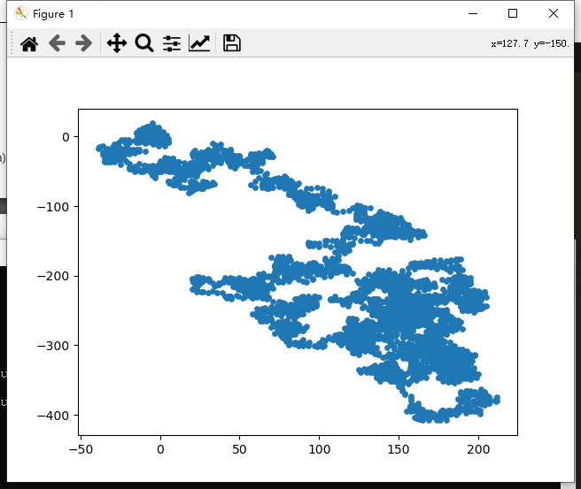


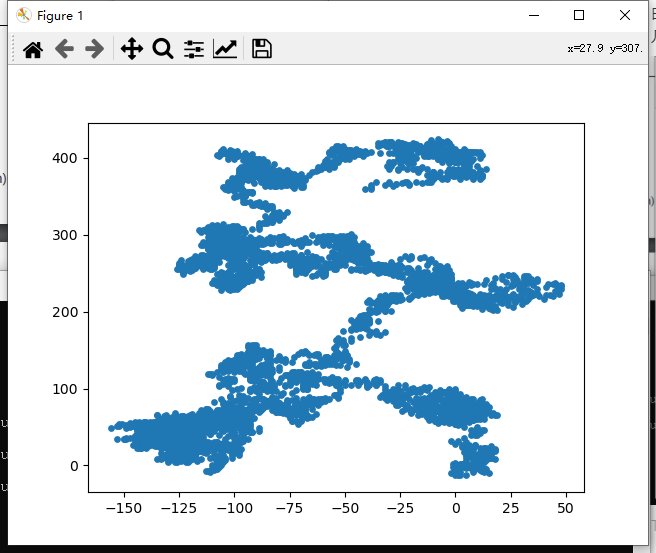

我们可以使用while循环来进行多次的随机漫步模拟：

```python
import matplotlib.pyplot as plt
from random_walk import RandomWalk

# 只要程序处于活动状态，就不断地模拟随机漫步
while True:
  # 创建一个RandomWalk实例，并将其包含的点都绘制出来
  rw = RandomWalk()
  rw.fill_walk()
  plt.scatter(rw.x_values, rw.y_values, s=15)
  plt.show()
  keep_running = input("Make another walk? (y/n): ")
  if keep_running == 'n':
    break
```


为了突出每次漫步的重要特征，并且让分散注意力的元素不那么显眼，我们可以突出漫步的起点，终点和经过的路径，也就是给点着色：

```python
import matplotlib.pyplot as plt
from random_walk import RandomWalk

while True:
  # 创建一个RandomWalk实例，并将其包含的点都绘制出来
  rw = RandomWalk()
  rw.fill_walk()
  point_numbers = list(range(rw.num_points))
  plt.scatter(rw.x_values, rw.y_values, c=point_numbers, cmap=plt.cm.Blues, edgecolor='none', s=15)
  plt.show()
  
  keep_running = input("Make another walk? (y/n): ")
  if keep_running == 'n':
    break
```


运行的结果如下所示：


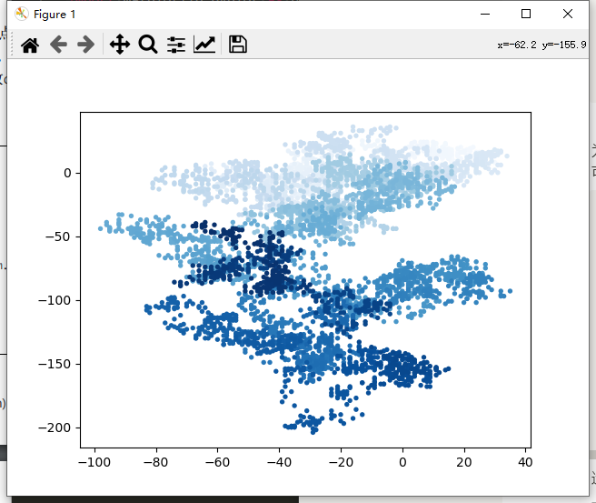


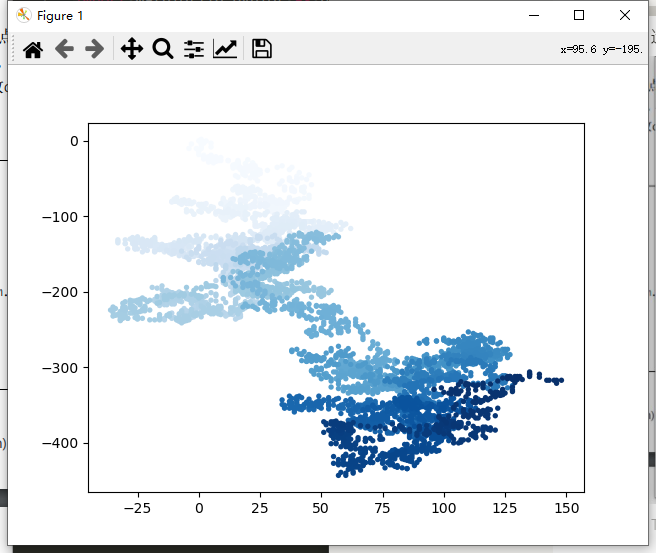


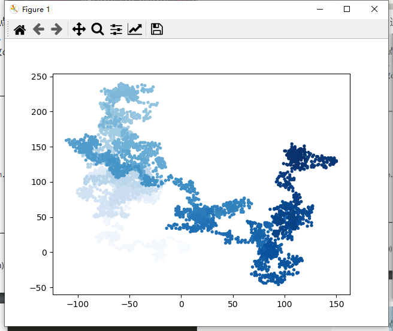

我们首先通过point_numbers = list(range(rw.num_points))来生成了一个数字列表，其中包含的数字个数与漫步包含的点数相同，并且这个列表被存储在point_numbers中，以便于后面使用它来设置每个漫步点数的颜色。

我们将参数c设置为point_numbers，指定使用颜色映射Blues，并传递实参edgecolor=none以删除每个点周围的轮廓。最终的随机漫步图从浅蓝色渐变为深蓝色。

我们可以在绘制随机漫步图后重新绘制起点和终点。我们让起点和终点变得更大，并显示为不同的颜色，以突出它们：

```python
import matplotlib.pyplot as plt
from random_walk import RandomWalk

while True:
  # 创建一个RandomWalk实例，并将其包含的点都绘制出来
  rw = RandomWalk()
  rw.fill_walk()
  point_numbers = list(range(rw.num_points))
  plt.scatter(rw.x_values, rw.y_values, c=point_numbers, cmap=plt.cm.Blues, edgecolor='none', s=15)
  
  plt.scatter(0, 0, c='green', edgecolors='none', s=100)
  plt.scatter(rw.x_values[-1], rw.y_values[-1], c='red', edgecolors='none', s=100)

  # 隐藏坐标轴
  plt.axes().get_xaxis().set_visible(False)
  plt.axes().get_yaxis().set_visible(False) 

  plt.show() 

  keep_running = input("Make another walk? (y/n): ")
  if keep_running == 'n':
    break
```


为突出起点，我们使用绿色绘制点(0, 0)，并使其比其他点大（s=100）。为突出终点，我们在漫步包含的最后一个x和y值处绘制一个点，将其颜色设置为红色，并将尺寸设置为100。

运行结果为：


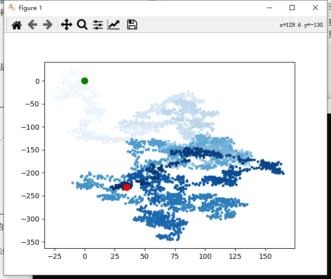


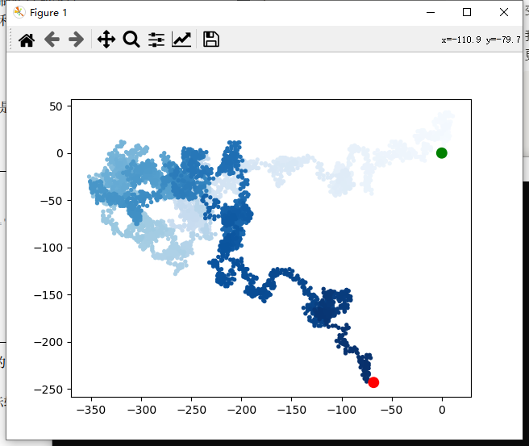

如果我们不需要坐标轴，我们可以这样设置：

```python
import matplotlib.pyplot as plt
from random_walk import RandomWalk

while True:
  # 创建一个RandomWalk实例，并将其包含的点都绘制出来
  rw = RandomWalk()
  rw.fill_walk()
  point_numbers = list(range(rw.num_points))
  plt.scatter(rw.x_values, rw.y_values, c=point_numbers, cmap=plt.cm.Blues, edgecolor='none', s=15)
  
  plt.scatter(0, 0, c='green', edgecolors='none', s=100)
  plt.scatter(rw.x_values[-1], rw.y_values[-1], c='red', edgecolors='none', s=100)

  # 隐藏坐标轴
  plt.axes().get_xaxis().set_visible(False)
  plt.axes().get_yaxis().set_visible(False) 

  plt.show() 

  keep_running = input("Make another walk? (y/n): ")
  if keep_running == 'n':
    break
```


运行的结果为：


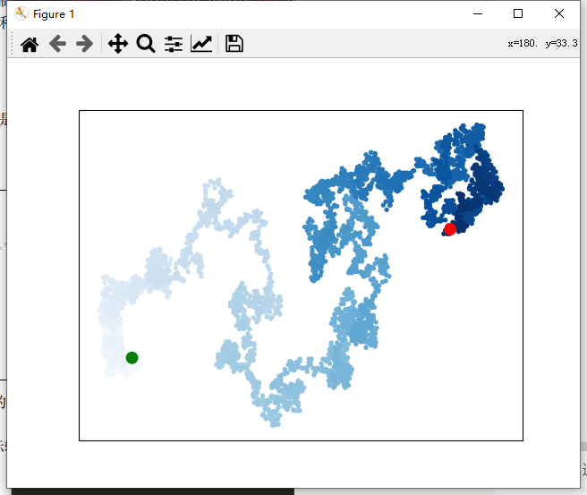

为修改坐标轴，使用了函数plt.axes()来将每条坐标轴的可见性都设置为False。

我们可以在创建RandomWalk实例的时候增大num_points的值，并且在绘图时调整每个点的大小：

```python
import matplotlib.pyplot as plt
from random_walk import RandomWalk

while True:
  # 创建一个RandomWalk实例，并将其包含的点都绘制出来
  rw = RandomWalk(50000)
  rw.fill_walk()

  # 绘制点并将图形显示出来
  point_numbers = list(range(rw.num_points))

  plt.scatter(rw.x_values, rw.y_values, c=point_numbers, cmap=plt.cm.Blues, edgecolor='none', s=1) 

  point_numbers = list(range(rw.num_points))
  plt.scatter(rw.x_values, rw.y_values, c=point_numbers, cmap=plt.cm.Blues, edgecolor='none', s=15)
  
  plt.scatter(0, 0, c='green', edgecolors='none', s=100)
  plt.scatter(rw.x_values[-1], rw.y_values[-1], c='red', edgecolors='none', s=100)

  # 隐藏坐标轴
  plt.axes().get_xaxis().set_visible(False)
  plt.axes().get_yaxis().set_visible(False) 

  plt.show() 

  keep_running = input("Make another walk? (y/n): ")
  if keep_running == 'n':
    break
```


这这里模拟了一次包含50000个点的随机漫步，并且将每个点的大小都设置为1。

运行的结果如下所示：


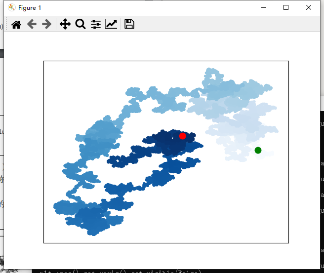

为了方便我们进行观察，我们可以设置matplotlib的输出的尺寸：

```python
import matplotlib.pyplot as plt
from random_walk import RandomWalk

while True:
  # 创建一个RandomWalk实例，并将其包含的点都绘制出来
  rw = RandomWalk(50000)
  rw.fill_walk()

  #设置窗口的尺寸
  plt.figure(figsize = (10, 6))

  # 绘制点并将图形显示出来
  point_numbers = list(range(rw.num_points))

  plt.scatter(rw.x_values, rw.y_values, c=point_numbers, cmap=plt.cm.Blues, edgecolor='none', s=1) 

  point_numbers = list(range(rw.num_points))
  plt.scatter(rw.x_values, rw.y_values, c=point_numbers, cmap=plt.cm.Blues, edgecolor='none', s=15)
  
  plt.scatter(0, 0, c='green', edgecolors='none', s=100)
  plt.scatter(rw.x_values[-1], rw.y_values[-1], c='red', edgecolors='none', s=100)

  # 隐藏坐标轴
  plt.axes().get_xaxis().set_visible(False)
  plt.axes().get_yaxis().set_visible(False) 

  plt.show() 

  keep_running = input("Make another walk? (y/n): ")
  if keep_running == 'n':
    break
```


运行的结果为：


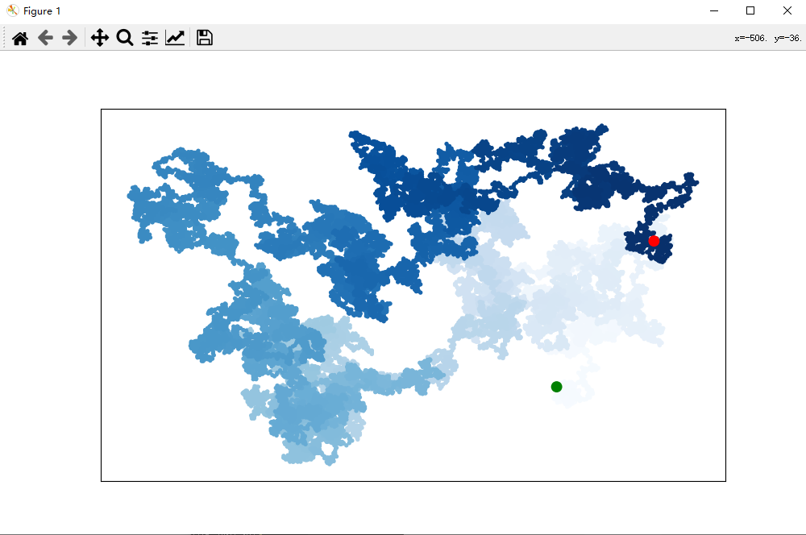

# 使用Pygal模拟骰子

我们首先要使用pip来安装Pygal：

```python
pip3 install Pygal
```


然后我们可以创建一个die类来模拟骰子：

```python
from random import randint

class Die():
  """表示一个骰子的类"""

  def __init__(self, num_sides = 6):
    """骰子默认为6面"""
    self.num_sides = num_sides

  def roll(self):
    """返回一个位于1和骰子面数之间的随机值"""
    return randint(1, self.num_sides)
```


方法__init__()接受一个可选参数。创建这个类的实例时，如果没有指定任何实参，面数默认为6；如果指定了实参，这个值将用于设置骰子的面数。骰子是根据面数命名的，6面的骰子名为D6，8面的骰子名为D8，以此类推。

方法roll()使用函数randint()来返回一个1和面数之间的随机数。这个函数可能返回起始值1、终止值num_sides或这两个值之间的任何整数。

然后我们可以投掷骰子，并且将结果打印出来，并且检查结果是否合理：

```python
from die import Die
# 创建一个D6
die = Die()
# 掷几次骰子，并将结果存储在一个列表中
results = []

for roll_num in range(100):
  result = die.roll()
  results.append(result)

print(results)
```


以下是一个示例结果集：

```python
[3, 3, 2, 1, 3, 4, 4, 4, 1, 2, 3, 3, 4, 1, 6, 3, 3, 6, 3, 1, 5, 5, 5, 4, 1, 5, 6, 1, 2, 3, 5, 3, 5, 3, 4, 3, 1, 6, 4, 5, 6, 3, 6, 1, 1, 1, 6, 2, 3, 2, 1, 1, 2, 3, 4, 6, 3, 6, 4, 3, 6, 5, 4, 1, 6, 1, 2, 6, 4, 1, 4, 6, 1, 4, 6, 4, 1, 4, 5, 3, 3, 3, 4, 2, 5, 2, 1, 4, 6, 1, 4, 1, 3, 1, 6, 4, 6, 6, 2, 1]
```


我们可以分析每一个点数出现的次数：

```python
from die import Die
# 创建一个D6
die = Die()
# 掷几次骰子，并将结果存储在一个列表中
results = []

for roll_num in range(100):
  result = die.roll()
  results.append(result)

# 分析结果
frequencies = []
for value in range(1, die.num_sides+1):
  frequency = results.count(value)
  frequencies.append(frequency)

print(frequencies)
```


运行的结果为：

```python
[14, 22, 16, 17, 20, 11]
```


总体上来讲是合理的，我们可以试着多投几次，比如说投10000次数：

```python
from die import Die
# 创建一个D6
die = Die()
# 掷几次骰子，并将结果存储在一个列表中
results = []

for roll_num in range(10000):
  result = die.roll()
  results.append(result)

# 分析结果
frequencies = []
for value in range(1, die.num_sides+1):
  frequency = results.count(value)
  frequencies.append(frequency)

print(frequencies)
```


得到的结果为：

```python
[1646, 1727, 1676, 1666, 1632, 1653]
```


可以发现出现的次数是非常的合理的。

或者我们可以将其可视化，当我们有了用来表示频率的列表之后，我们可以绘制一个结果的直方图：

```python
import pygal
from die import Die
# 创建一个D6
die = Die()
# 掷几次骰子，并将结果存储在一个列表中
results = []

for roll_num in range(10000):
  result = die.roll()
  results.append(result)

# 分析结果
frequencies = []
for value in range(1, die.num_sides+1):
  frequency = results.count(value)
  frequencies.append(frequency)

# 对结果进行可视化
hist = pygal.Bar()

hist.title = "Results of rolling one D6 10000 times."
hist.x_labels = ['1', '2', '3', '4', '5', '6']
hist.x_title = "Result"
hist.y_title = "Frequency of Result"

hist.add('D6', frequencies)
hist.render_to_file('die_visual.svg')
```


我们首先创建了一个个pygal.Bar()实例例，并将其存储在hist中。

接下来，我们设置hist的属性title（用于标示直方图的字符串），将掷D6骰子的可能结果用作x轴的标签，并给每个轴都添加了标题。

我们使用add()将一系列值添加到图表中（向它传递要给添加的值指定的标签，还有一个列表，其中包含将出现在图表中的值）。最后，我们将这个<br />图表渲染为一个SVG文件，这种文件的扩展名必须为.svg。

我们可以在件die_visual.py所在的文件夹找到件die_visual.svg文件，可以用浏览器打开这个文件，得到的结果如下所示：


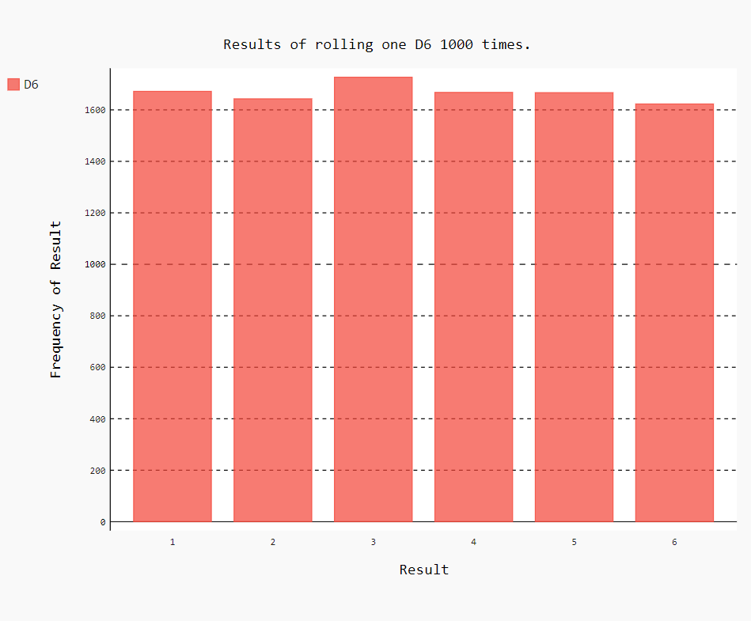

我们可以试着将投掷的次数再增加，那么我们会得到的结果是：


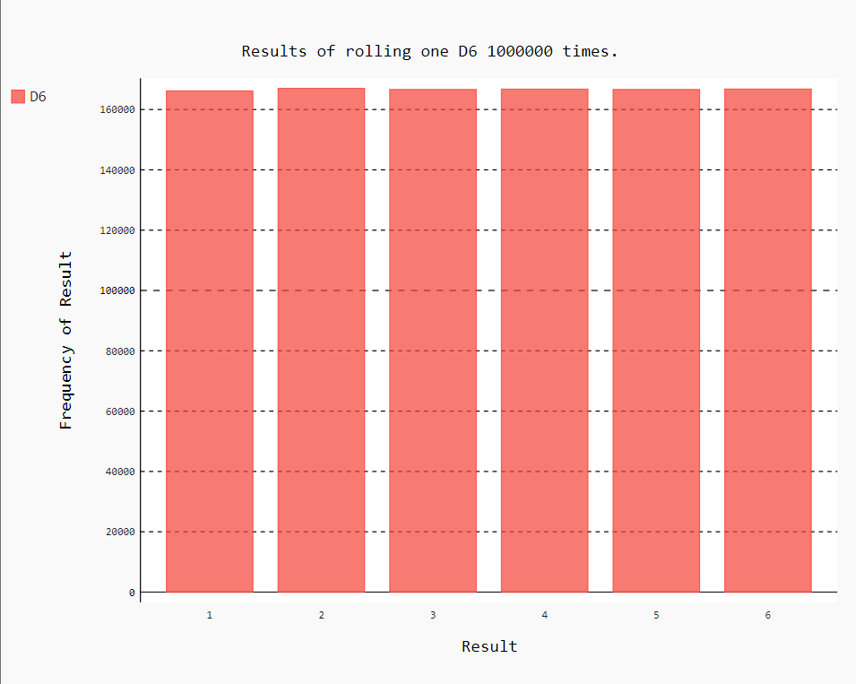

可以发现随着投掷的次数的增加，各个点数出现的频率越发的接近。

