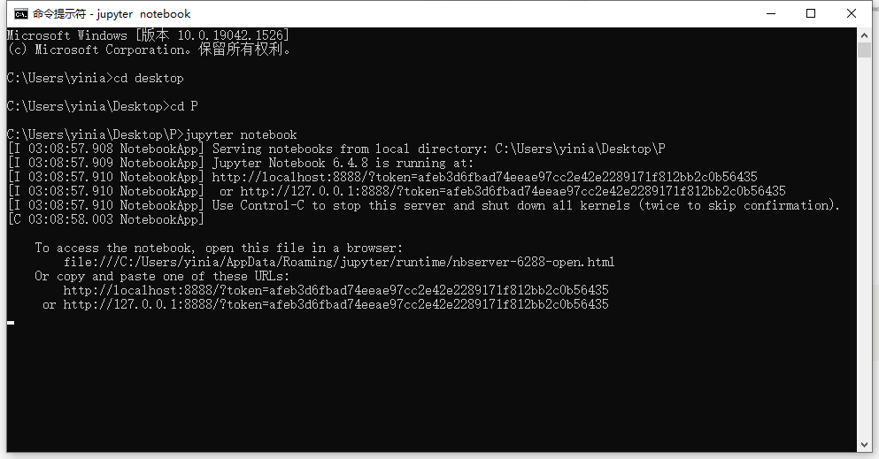
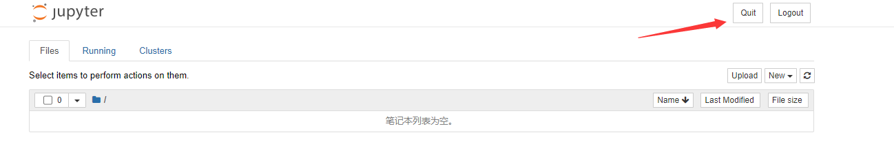
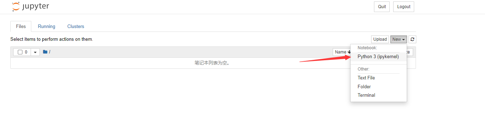
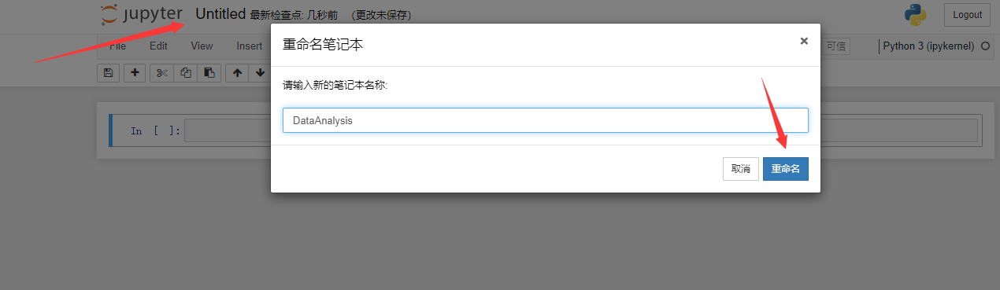
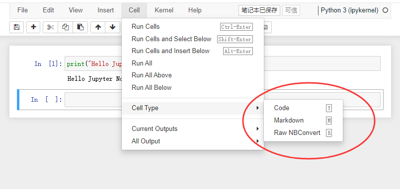
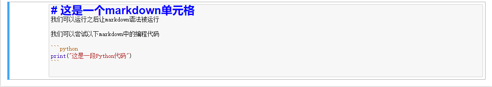

# 数据分析——Jupyter Notebook基础使用方法

我们首先需要安装jupyter notebook：


接着我们需要创建一个文件夹，接着使用cmd，使用cd导入到该文件夹。

接着在cmd上输入：

```python
jupyter notebook
```


我们会看到如下所示的一些界面：




jupyter notebook相当于是一个使用浏览器的编译器，在运行的过程中我们不能够关闭CMD界面，否则程序会停止运行，如果我们想要停止运行，可以选择先点击QUIT按钮，然后关闭浏览器页面和CMD界面。



接着我们来创建一个Python 3的文件：



并且将其命名为：



我们可以尝试着运行一行代码来试试看是否能够成功的运行：


运行的快捷键为：ctrl+enter。

我们可以在已有的单元格下面添加一个新的单元格：


快捷键为B。

单元格也可以是别的格式的文本：



我们可以试一下markdown语法：



运行之后的结果为：


我们可以直接将截图复制到markdown文件中，运行的结果为：


