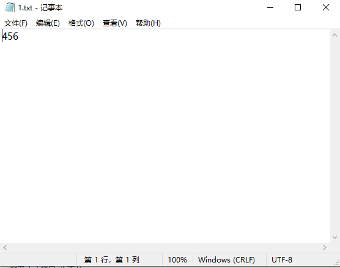

# Python办公：读写 txt 文件

## 写入文件

Python的write()方法用于向文件中写入指定字符串。

在文件关闭或者缓冲区刷新之前，字符串内容存储在缓冲区，这是你在文件中是看不到写入的内容的。

如果文件打开模式带b，那么写入文件内容的时候，str(参数)要用encode方法转换为bytes形式，否则会报错。

write()的方法语法如下所示：

```python
fileObject.write([str])
```


str是需要被写入文件的字符串，返回值则是写入的字符长度。

我们先创建一个名为1.txt的文本文件：

```python
with open('1.txt', 'w') as f:
  length = f.write("456")
  print(length)
  f.close()
```


输入如上所示的代码，运行的结果为：

```python
3
```


打开1.txt文件可以发现：



字符串被输入到了1.txt文件中。

## 读取文件

Python的read()方法用于从文件中读取指定的字节数，如果未给定或者为负则读取所有。

read()函数的语法如下所示：

```python
fileObject.read([size])
```


size参数为从文件中读取的字节数，默认为-1，表示读取整个文件。

返回值则是从字符串中读取的字节。

我们可以创建一个2.txt文件，然后在文件中输入字符串123456，接着来尝试read()函数：

```python
with open("2.txt", "r") as f:
  content = f.read(3)
  print(content)
```


运行的结果为：

```python
123
```


